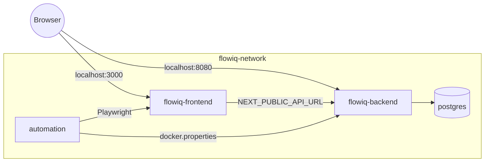

# Docker Infrastructure

Production-ready Docker setup for the full Flowiq stack: **PostgreSQL**, **backend**, **frontend**, and **test automation**.

## Repository layout

Docker orchestration lives in **flowiq-automation**. Dockerfiles are in each project:

```
IdeaProjects/
├── flowiq-automation/
│   ├── docker-compose.yml          # Full stack
│   ├── docker-compose.test.yml     # Test runner overlay
│   ├── Dockerfile                  # Automation image
│   ├── .env.example
│   └── docs/DOCKER.md
├── flowiq-backend/
│   └── Dockerfile
└── flowiq-frontend/
    └── Dockerfile
```

All three repositories must be cloned as **siblings** (same parent folder).

## Prerequisites

| Tool | Version |
|------|---------|
| Docker | 24+ |
| Docker Compose | v2 (`docker compose`) |
| Disk | ~4 GB free (images + DB volume) |

## Quick start

```bash
cd flowiq-automation
cp .env.example .env

# Build and start full stack (postgres + backend + frontend + automation)
docker compose up -d --build

# Check status
docker compose ps
```

### URLs (host)

| Service | URL |
|---------|-----|
| Frontend | http://localhost:3000 |
| Backend API | http://localhost:8080/api |
| Swagger | http://localhost:8080/swagger-ui.html |
| Health | http://localhost:8080/api/health |
| PostgreSQL | `localhost:5432` (user `flowiq` / `flowiq123`) |

### Demo login

- Email: `demo@flowiq.ai`
- Password: `demo123`

Seeded automatically by `DemoUserSeedService` on backend startup.

---

## Services

### `postgres`

- Image: `postgres:15-alpine`
- Volume: `flowiq-postgres-data`
- Healthcheck: `pg_isready`

### `flowiq-backend`

- Multi-stage build (Maven → JRE 17 Alpine)
- Profile: `docker` (`application-docker.properties`)
- Depends on: `postgres` (healthy)
- Healthcheck: `GET /api/health`

### `flowiq-frontend`

- Next.js 16 **standalone** production build
- Build arg: `NEXT_PUBLIC_API_URL` (default `http://localhost:8080/api` for host browser)
- Depends on: `flowiq-backend` (healthy)
- Healthcheck: `GET /`

### `automation`

- Maven 17 + Playwright Chromium
- Idle by default (`tail -f /dev/null`) — ready for test execution
- Env: `docker.properties` (`api.url=http://flowiq-backend:8080/api`, `base.url=http://flowiq-frontend:3000`)
- Volume: `flowiq-automation-target` → `/app/target`

### Network

All services use bridge network **`flowiq-network`**.

---

## Running automation tests

Start the stack first (if not already running):

```bash
docker compose up -d
```

Run tests with the **test overlay**:

```bash
# API smoke (default)
docker compose -f docker-compose.yml -f docker-compose.test.yml run --rm automation

# Contract tests
TEST_PROFILE=contract docker compose -f docker-compose.yml -f docker-compose.test.yml run --rm automation

# UI smoke (Playwright against flowiq-frontend container)
TEST_PROFILE=ui-smoke docker compose -f docker-compose.yml -f docker-compose.test.yml run --rm automation

# API regression
TEST_PROFILE=api-regression docker compose -f docker-compose.yml -f docker-compose.test.yml run --rm automation
```

### Available `TEST_PROFILE` values

| Profile | Maven | Description |
|---------|-------|-------------|
| `api-smoke` | `-Papi-smoke` | Live API smoke suite |
| `contract` | `-Pcontract` | JSON Schema contract tests |
| `ui-smoke` | `-Pui-smoke` | UI smoke (screenshots/traces/videos on failure) |
| `api-regression` | `-Papi-regression` | Full API regression |
| `smoke` | `-Psmoke` | Combined smoke suite |

### Test artifacts

Stored in Docker volume `flowiq-automation-target`:

```bash
# Copy Allure results to host
docker compose run --rm -v "${PWD}/reports:/export" automation \
  bash -lc "cp -r target/allure-results /export/ 2>/dev/null || true"

# Or inspect inside volume
docker run --rm -v flowiq-automation-target:/data alpine ls -la /data
```

After test run, Allure HTML is generated inside the container at `target/site/allure-maven-plugin`.

---

## Environment variables

Copy `.env.example` → `.env`:

| Variable | Default | Description |
|----------|---------|-------------|
| `POSTGRES_*` | flowiq / flowiq123 | Database credentials |
| `BACKEND_PORT` | 8080 | Host port for API |
| `FRONTEND_PORT` | 3000 | Host port for UI |
| `NEXT_PUBLIC_API_URL` | `http://localhost:8080/api` | Baked into frontend at **build** time |
| `JWT_SECRET` | dev secret | Backend JWT signing key |
| `TEST_USER_EMAIL` | demo@flowiq.ai | Automation login |
| `TEST_USER_PASSWORD` | demo123 | Automation password |
| `TEST_PROFILE` | api-smoke | Suite for `docker-compose.test.yml` |

---

## Common commands

```bash
# Start full stack
docker compose up -d --build

# View logs
docker compose logs -f flowiq-backend
docker compose logs -f flowiq-frontend

# Rebuild single service
docker compose up -d --build flowiq-backend

# Stop stack (keep data)
docker compose down

# Stop and remove volumes (reset DB + test artifacts)
docker compose down -v

# Shell into automation container
docker compose exec automation bash

# Run Maven manually inside automation
docker compose exec automation mvn test -Pcontract -Denv=docker -B
```

---

## Build images individually

```bash
# Backend
docker build -t flowiq-backend:local ../flowiq-backend

# Frontend
docker build -t flowiq-frontend:local \
  --build-arg NEXT_PUBLIC_API_URL=http://localhost:8080/api \
  ../flowiq-frontend

# Automation
docker build -t flowiq-automation:local .
```

---

## Architecture



---

## Troubleshooting

| Issue | Solution |
|-------|----------|
| `flowiq-backend` unhealthy | `docker compose logs flowiq-backend` — wait for Flyway migrations (~60–90s first start) |
| Frontend shows API errors | Rebuild frontend if API URL changed: `docker compose build flowiq-frontend` |
| CORS errors from browser | Frontend must be on `http://localhost:3000`; backend allows this origin |
| UI tests fail in automation | Ensure `base.url=http://flowiq-frontend:3000` in `docker.properties` (preconfigured) |
| Playwright browser missing | Rebuild automation image: `docker compose build automation` |
| Port already in use | Change `BACKEND_PORT` / `FRONTEND_PORT` / `POSTGRES_PORT` in `.env` |
| Sibling repo not found | Clone `flowiq-backend` and `flowiq-frontend` next to `flowiq-automation` |

---

## CI integration

GitHub Actions PR validation starts backend + PostgreSQL similarly. Local Docker stack mirrors CI contract-test environment with a full UI/API accessible from the host.

See also: [CI-CD.md](CI-CD.md)
