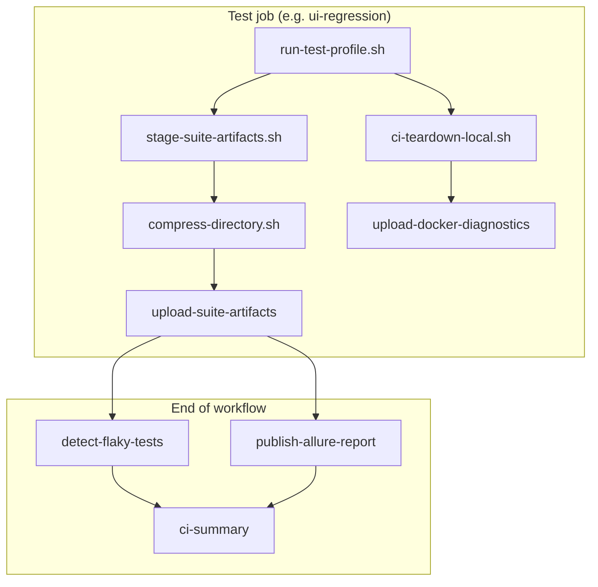

# CI Diagnostics and Artifact Collection

Production-grade diagnostic collection for failed (and completed) CI runs. All artifacts are **gzip-compressed** before upload; the nightly **`ci-summary`** job writes a **GitHub Actions Summary** with links to every artifact.

## Overview

| Category | Artifact pattern | Contents | When uploaded |
|----------|------------------|----------|---------------|
| **Docker diagnostics** | `{prefix}-{suite}-docker-diagnostics` | Compose logs, PostgreSQL/backend/frontend logs, `docker ps`, `docker inspect`, `docker images`, `docker stats` | Always after suite teardown |
| **Surefire** | `{prefix}-{suite}-surefire` | Maven Surefire XML reports | Always |
| **Allure results** | `{prefix}-{suite}-allure-results` | Raw Allure JSON + attachments | Always |
| **Allure HTML** | `{prefix}-{suite}-allure-report` | Per-suite HTML report | Always |
| **Traces** | `{prefix}-{suite}-traces` | Playwright trace ZIPs (failure-time) | UI suites only |
| **Screenshots** | `{prefix}-{suite}-screenshots` | Failure screenshots from Allure attachments | UI suites only |
| **Videos** | `{prefix}-{suite}-videos` | **Failed UI tests only** (Allure video attachments) | UI suites, only when failures exist |
| **Test logs** | `{prefix}-{suite}-logs` | Maven / Logback output | Always |
| **Combined Allure** | `{prefix}-allure-report-combined` | Merged HTML with history | Publish job |
| **Flaky report** | `{prefix}-flaky-report` | JSON + HTML flaky classification | Flaky detection job |

> **Extract compressed artifacts:** GitHub wraps uploads in a zip. Inside you will find `.tar.gz` files. Extract with `tar -xzf artifact.tar.gz`.

## Docker diagnostics bundle

Collected by `.github/scripts/ci/collect-logs.sh` and uploaded via `.github/actions/upload-docker-diagnostics/`.

```
ci-artifacts/
  compose.log              # All Compose services
  postgres.log             # PostgreSQL
  flowiq-backend.log       # Backend
  flowiq-frontend.log      # Frontend
  compose-ps.txt           # docker compose ps -a
  docker-ps.txt            # docker ps -a
  docker-images.txt        # docker images
  docker-stats.txt         # docker stats --no-stream
  inspect/*.json           # docker inspect per container
  README.txt               # Bundle index
```

**Mode A (shared stack):** one `{prefix}-docker-diagnostics` artifact from `teardown-environment`.

**Mode B (default):** per-suite `{prefix}-{suite}-docker-diagnostics` after each test job tears down its stack.

## UI failure artifacts (no application code changes)

Playwright runtime paths are under `target/` (hardcoded in test framework). The staging script resolves both `{TARGET_DIR}/…` and `target/…` fallbacks.

| Artifact | Source | Failed-only? |
|----------|--------|--------------|
| Traces | `target/traces/` + Allure failure attachments | Yes (traces saved on failure) |
| Screenshots | Allure failure attachments (`image/png`) | Yes |
| Videos | Allure failure attachments (`video/webm`) | **Yes — never uploads passing-test videos** |

Videos are extracted from Allure `*-result.json` where `status` is `failed` or `broken`. Passing UI tests may record video files on disk, but those are **not** uploaded.

## Pipeline integration



### CI Summary job

Job **`ci-summary`** runs last and writes to `GITHUB_STEP_SUMMARY`:

- Pipeline pass/fail status
- Link to workflow run artifacts section
- Allure GitHub Pages URL (when publish succeeds)
- Flaky / failed-only counts
- Table of every artifact with category, size, and download link

Action: `.github/actions/write-ci-summary/`

## Scripts and actions

| File | Purpose |
|------|---------|
| `.github/scripts/ci/collect-logs.sh` | Docker + Compose diagnostics |
| `.github/scripts/ci/stage-suite-artifacts.sh` | Stage Surefire, Allure, Playwright artifacts |
| `.github/scripts/ci/compress-directory.sh` | Create `.tar.gz` before upload |
| `.github/actions/upload-suite-artifacts/` | Stage, compress, upload per suite |
| `.github/actions/upload-docker-diagnostics/` | Compress and upload Docker bundle |
| `.github/actions/write-ci-summary/` | Artifact index in job summary |
| `.github/scripts/allure/allure-merge-results.sh` | Extracts compressed Allure inputs for merge |

## Compression

All diagnostic uploads use `compression-level: 0` on `actions/upload-artifact@v4` because payloads are pre-compressed with `tar -czf`. This avoids double compression and reduces upload time.

## Troubleshooting failed runs

1. Open the **CI Diagnostics Summary** job on the workflow run page.
2. Download `{prefix}-{suite}-docker-diagnostics` for stack issues.
3. Download `{prefix}-{suite}-surefire` and `{prefix}-{suite}-allure-results` for test failures.
4. For UI failures: `{prefix}-{suite}-traces`, `-screenshots`, `-videos`.
5. Open the [Allure GitHub Pages report](https://yevheniiadem.github.io/flowiq-automation/) for trends and history.

See also: [CI_INFRASTRUCTURE.md](CI_INFRASTRUCTURE.md), [FLAKY_TEST_DETECTION.md](FLAKY_TEST_DETECTION.md).
