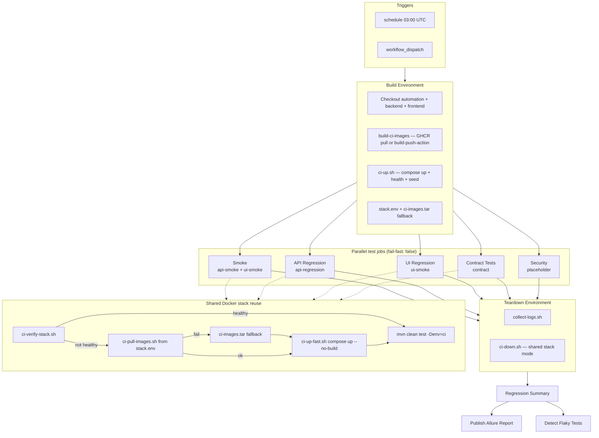
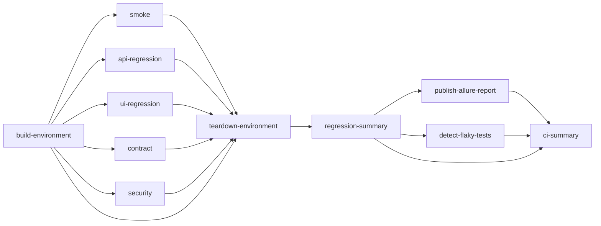
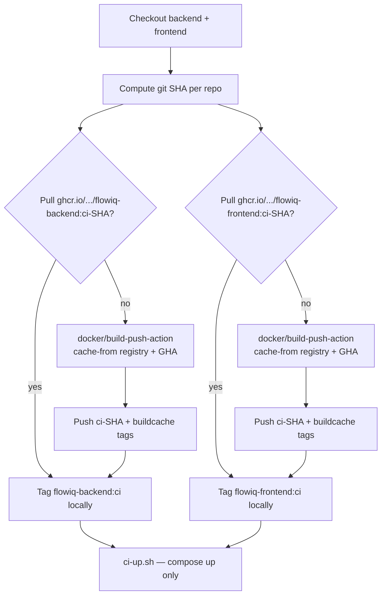
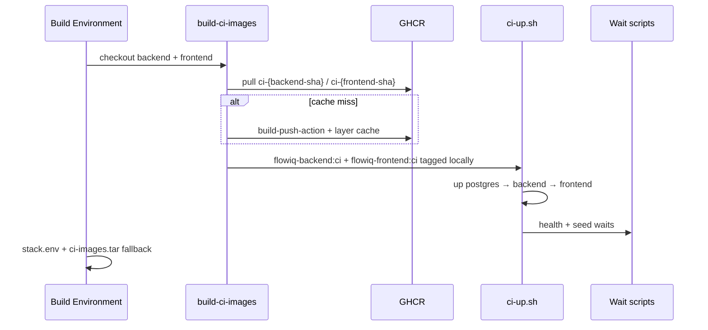
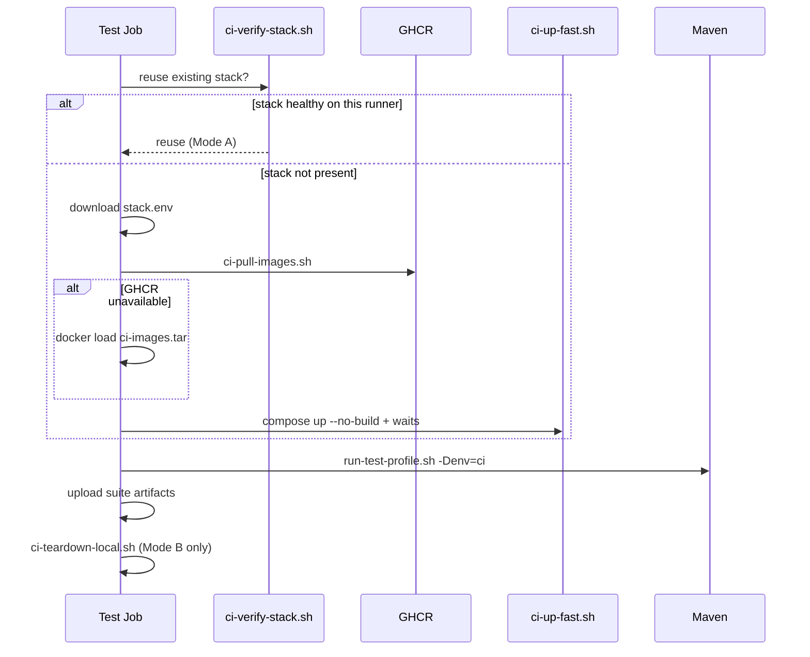
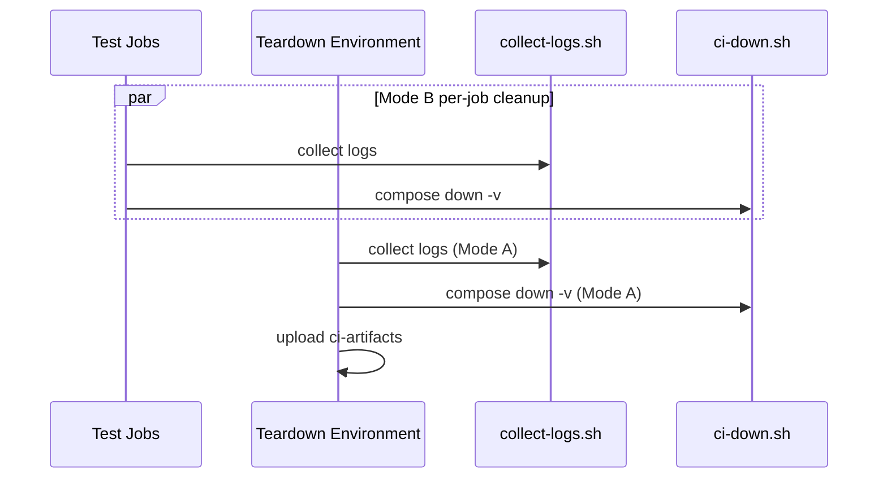
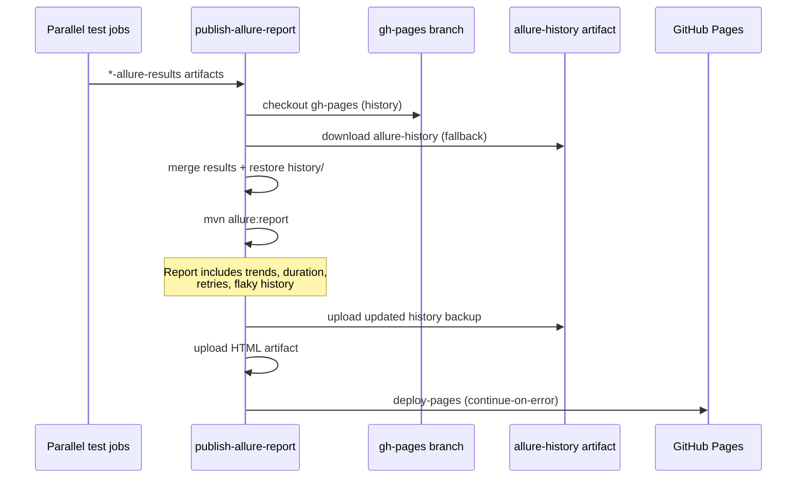

# CI Infrastructure — Ephemeral Nightly Regression

Production-grade ephemeral CI for FlowIQ automation. Every nightly run builds the environment once, executes test suites in **parallel jobs**, publishes per-suite artifacts, and tears down the Docker stack — with no dependency on a local machine or external stage environment.

## Parallel pipeline diagram



## Job dependency graph



| Job | `needs` | Runs when | Failure impact |
|-----|---------|-----------|----------------|
| **Build Environment** | — | Always | Blocks all test jobs |
| **Smoke** | `build-environment` | `full` or `smoke` | Does **not** block API/UI/contract |
| **API Regression** | `build-environment` | `full` or `api` | Independent |
| **UI Regression** | `build-environment` | `full` or `ui` | Independent |
| **Contract Tests** | `build-environment` | `full` or `contract` | Independent |
| **Security** | `build-environment` | `full` or `security` | Placeholder only |
| **Teardown Environment** | all above | `always()` | Collects logs, destroys stack |
| **Regression Summary** | all above + teardown | `always()` | Fails workflow if any required suite failed |
| **Publish Allure Report** | test jobs + summary + flaky | `always()` | **`continue-on-error: true`** |
| **Detect Flaky Tests** | test jobs + summary | `always()` | **`continue-on-error: true`** — classification only, no reruns |
| **CI Diagnostics Summary** | summary + flaky + publish | `always()` | Writes artifact index to job summary |

Test jobs have **no dependency on each other** — a failed UI job does not prevent API regression from running.

## Shared stack model

Docker images are **built or pulled exactly once** in **Build Environment** using GHCR layer caching. Test jobs reuse images via GHCR pull (preferred) or tarball fallback.

### Mode A — Shared running stack (`CI_SHARED_STACK=true`)

Recommended for **self-hosted runners** with a shared Docker daemon (`CI_RUNNER_LABELS`).

1. **Build Environment** resolves images (GHCR pull or build), starts the stack, publishes `stack.env`.
2. Parallel test jobs call `ci-verify-stack.sh` — if health + seed checks pass, **no re-provision**.
3. **Teardown Environment** runs `ci-down.sh` once after all suites finish.

### Mode B — Per-job fast start (default on `ubuntu-latest`)

Used on **GitHub-hosted runners** (each job is an isolated VM).

1. **Build Environment** pushes/pulls GHCR images and exports `stack.env` + optional `ci-images.tar`.
2. Each test job downloads `stack.env`, runs `ci-pull-images.sh` (GHCR), falls back to tarball, then `ci-up-fast.sh`.
3. Each job tears down its local stack in `ci-teardown-local.sh`.

Images are identical across jobs; test jobs **never run `docker compose build`** when cache is available.

| Variable | Default | Purpose |
|----------|---------|---------|
| `CI_SHARED_STACK` | `false` | `true` = verify/reuse running stack; central teardown |
| `CI_RUNNER_LABELS` | `ubuntu-latest` | Pin all jobs to the same self-hosted pool for Mode A |

## Docker image caching (GHCR)

Production-grade layer caching avoids rebuilding backend/frontend from scratch on every run.

### Strategy



| Tag | Purpose |
|-----|---------|
| `ghcr.io/{owner}/flowiq-backend:ci-{git-sha}` | Immutable image — **skip build when tag exists** |
| `ghcr.io/{owner}/flowiq-backend:buildcache` | Registry layer cache for `cache-from` / `cache-to` |
| `ghcr.io/{owner}/flowiq-frontend:ci-{git-sha}` | Immutable frontend image |
| `ghcr.io/{owner}/flowiq-frontend:buildcache` | Frontend layer cache |

**Build only when source changed:** tags are keyed to the checked-out commit SHA. Unchanged backend/frontend commits produce a cache hit (pull only, no build).

**Fallback:** if GHCR is unreachable or images are missing, `ci-resolve-images.sh` runs `docker compose build` locally (same compose architecture as before).

### Permissions and registry

- Workflow requires `packages: write` to push to GHCR via `GITHUB_TOKEN`.
- Images are stored under the **automation repository owner's** GHCR namespace.
- Set package visibility to **public** (or grant cross-repo read) if backend/frontend repos are in a different org.

### Key scripts and actions

| Component | Role |
|-----------|------|
| `.github/actions/build-ci-images/` | `docker/build-push-action` + GHCR pull-by-SHA |
| `ci-resolve-images.sh` | Local/GHA: pull GHCR → fallback `compose build` |
| `ci-pull-images.sh` | Pull explicit GHCR refs, tag `flowiq-*:ci` |
| `ci-up-fast.sh` | GHCR pull from `stack.env`, then tarball, then compose up |
| `stack.env` artifact | `BACKEND_IMAGE`, `FRONTEND_IMAGE`, cache hit flags, timing |

### Expected build time improvements

Measured from Build Environment **image resolve/build** step (`build-duration-seconds` in `stack.env`):

| Scenario | Before (compose build every run) | After (GHCR caching) | Improvement |
|----------|----------------------------------|----------------------|-------------|
| **Full cache hit** (both SHAs unchanged) | 8–15 min | **1–3 min** (pull only) | **~70–85%** |
| **Partial hit** (one repo changed) | 8–15 min | **4–8 min** (one pull + one cached build) | **~40–55%** |
| **Cold miss** (new SHA, warm layer cache) | 8–15 min | **5–10 min** (registry + GHA layer cache) | **~25–40%** |
| **Fully cold** (no registry cache) | 8–15 min | 8–14 min (same as before, still pushes cache) | ~0–10% |

Test job stack startup (GHCR pull vs tarball):

| Method | Typical duration |
|--------|------------------|
| GHCR pull (Mode B) | **1–2 min** |
| `ci-images.tar` download + load | 2–5 min |
| Local `compose build` fallback | 8–15 min |

**Overall pipeline (full parallel, warm cache hit):** Build Environment drops from ~12–20 min to **~4–8 min**, reducing total nightly time by **~8–12 min**.

| Service | Image / build | Network | Host port | Persistence |
|---------|---------------|---------|-----------|-------------|
| `postgres` | `postgres:15-alpine` | `flowiq-ci-network` | 5432 | **None** (`tmpfs`) |
| `flowiq-backend` | GHCR `ci-{sha}` or build fallback | internal | 8080 | None |
| `flowiq-frontend` | GHCR `ci-{sha}` or build fallback | internal | 3000 | None |
| `mailhog` | `mailhog/mailhog` | internal | 1025, 8025 | Profile `mailhog` |
| `minio` | `minio/minio` | internal | 9000, 9001 | Profile `minio`, `tmpfs` |
| `redis` | `redis:7-alpine` | internal | 6379 | Profile `redis`, `tmpfs` |

**Key files**

| File | Purpose |
|------|---------|
| `docker-compose.ci.yml` | Ephemeral stack (no named volumes) |
| `src/main/resources/environments/ci.properties` | Test URLs for runner → `localhost` ports |
| `.github/scripts/ci/*.sh` | Wait, retry, up/down, profile runners |
| `.github/actions/build-ci-images/` | GHCR pull-by-SHA or `docker/build-push-action` |
| `.github/actions/ephemeral-stack/` | Start stack after images resolved |
| `.github/actions/ensure-ci-stack/` | Verify reuse, GHCR pull, or tarball fallback |
| `.github/actions/ephemeral-stack-teardown/` | Log collection + `ci-down.sh` |
| `.github/actions/setup-ci-test-runner/` | Java + optional Playwright |
| `.github/actions/publish-allure-pages/` | Merge results, history, GitHub Pages deploy |
| `.github/actions/upload-suite-artifacts/` | Per-suite Surefire, Allure, Playwright artifacts |
| `.github/scripts/allure/*.sh` | Merge, restore history, generate report |
| `.github/workflows/nightly-regression.yml` | Parallel nightly pipeline |

## Startup sequence (Build Environment)



## Test job sequence (parallel)



Each suite uses an isolated Maven target directory (e.g. `target/api-regression`) to avoid collisions when jobs share a runner.

## Shutdown sequence



## Workflow explanation

### Triggers

| Trigger | Behavior |
|---------|----------|
| `schedule: 0 3 * * *` | Full parallel pipeline nightly |
| `workflow_dispatch` | Manual run with branch/suite selection |

### Manual inputs

| Input | Default | Description |
|-------|---------|-------------|
| `automation_ref` | current branch | Automation repo ref |
| `backend_ref` | `main` | Backend repo ref |
| `frontend_ref` | `main` | Frontend repo ref |
| `test_suite` | `full` | `full` runs all parallel jobs; or single suite |
| `optional_services` | empty | Enable `mailhog`, `minio`, or `redis` profile |

### Suite → job mapping

| `test_suite` | Jobs executed |
|--------------|---------------|
| `full` | Smoke, API, UI, Contract, Security (parallel) |
| `smoke` | Smoke only |
| `api` | API Regression only |
| `ui` | UI Regression only |
| `contract` | Contract only |
| `security` | Security placeholder only |

### Maven profiles per job

| Job | Profiles | Playwright |
|-----|----------|------------|
| Smoke | `api-smoke`, `ui-smoke` | Yes |
| API Regression | `api-regression` | No |
| UI Regression | `ui-smoke` | Yes |
| Contract | `contract` | No |
| Security | *(placeholder)* | No |

Local equivalent for a single suite:

```bash
TARGET_DIR=target/api-regression .github/scripts/ci/run-test-profile.sh api-regression
```

### Retry strategy

Infrastructure only — **failed tests are never retried**.

| Operation | Mechanism |
|-----------|-----------|
| Docker pull / GHCR | `retry.sh` (5 attempts, 15s delay) |
| Compose up | `retry.sh` |
| Compose build | `retry.sh` (fallback only) |
| Health checks | Polling wait scripts |
| Backend startup | Sequential up + `wait-for-backend-health.sh` |

### Artifacts (always uploaded per suite, even on failure)

All suite and Docker artifacts are **gzip-compressed** (`.tar.gz`) before upload. See [CI_DIAGNOSTICS.md](CI_DIAGNOSTICS.md) for the full diagnostic guide.

| Artifact pattern | Contents |
|------------------|----------|
| `{prefix}-{suite}-surefire` | Surefire XML (compressed) |
| `{prefix}-{suite}-allure-results` | Raw Allure results (compressed) |
| `{prefix}-{suite}-allure-report` | Allure HTML (compressed) |
| `{prefix}-{suite}-traces` | Playwright traces — UI jobs (compressed) |
| `{prefix}-{suite}-screenshots` | Failure screenshots from Allure — UI jobs (compressed) |
| `{prefix}-{suite}-videos` | **Failed UI tests only** — Allure video attachments (compressed) |
| `{prefix}-{suite}-logs` | Test logs (compressed) |
| `{prefix}-{suite}-docker-diagnostics` | Compose + PostgreSQL + backend + frontend logs, `docker ps/inspect/images/stats` (compressed) |
| `{prefix}-docker-diagnostics` | Central Docker diagnostics (Mode A shared stack) |
| `{prefix}-allure-report-combined` | Merged HTML with history (compressed) |
| `{prefix}-allure-results-combined` | Merged raw Allure results (compressed) |
| `allure-history` | History JSON backup for next run (90-day retention) |
| `flaky-test-history` | Cross-run execution store for flaky classification (90-day retention) |
| `{prefix}-flaky-report` | `flaky-report.json` + `flaky-report.html` (compressed) |
| `stack-metadata-{run}` | GHCR image refs, SHAs, cache hit flags, build seconds |
| `ci-images-{run}` | Tarball fallback when GHCR pull fails (1-day retention) |

The **`ci-summary`** job writes a GitHub Actions Summary with links to every artifact.

Retention: 30 days (test artifacts), 90 days (history backup), 14 days (logs and Docker diagnostics).

## Allure reporting and GitHub Pages

Production-grade Allure reporting merges parallel suite results, **preserves history between runs**, and publishes to GitHub Pages automatically.

### Live report URL

**[https://yevheniiadem.github.io/flowiq-automation/](https://yevheniiadem.github.io/flowiq-automation/)**

### One-time GitHub Pages setup

1. Open **Settings → Pages → Build and deployment**.
2. Set **Source** to **GitHub Actions**.
3. The `publish-allure-report` job uses the `github-pages` environment.

If Pages is not configured or deploy fails, the workflow **still completes** — download `*-allure-report-combined` from Actions artifacts.

### History pipeline



### What history preserves

Allure history is stored under `history/*.json` in the generated report and restored before each build:

| Allure feature | Source |
|----------------|--------|
| **Trends** | Historical pass/fail counts per test |
| **Duration** | Execution time trends over runs |
| **Retries** | Retry counts from result JSON (TestNG + Allure listener) |
| **Flaky** | Tests that flip between passed/failed across runs |

No test code changes are required — data comes from existing Allure result files and the history plugin.

### History sources (priority order)

1. **`gh-pages` branch** — `history/` from the last deployed report (primary)
2. **`allure-history` artifact** — backup from the previous workflow run
3. **None** — first run; trends start fresh

After generation, the new report's `history/` folder is deployed to Pages and saved as the `allure-history` artifact for the next run.

## Flaky test detection

Nightly CI **classifies** business-test instability without rerunning tests. See [FLAKY_TEST_DETECTION.md](FLAKY_TEST_DETECTION.md) for full documentation.

| Output | Description |
|--------|-------------|
| GitHub Actions Summary | Separate **Failed** vs **Flaky** tables |
| `flaky-report.json` | Machine-readable classification |
| `flaky-report.html` | Human-readable report |
| `flaky-test-history` | 30-run execution store (independent from Allure history) |

Infrastructure retries (`retry.sh`, Docker, compose) never appear in flaky analysis.

### Resilience

| Step | On failure |
|------|------------|
| `publish-allure-report` job | `continue-on-error: true` — workflow succeeds |
| gh-pages checkout | `continue-on-error` — uses artifact backup or fresh history |
| Download suite results | `continue-on-error` — publishes empty/partial report with warning |
| `deploy-pages` | `continue-on-error` — HTML artifact still uploaded |

### Key scripts

| Script | Purpose |
|--------|---------|
| `allure-merge-results.sh` | Flatten parallel job `*-allure-results` into one directory |
| `allure-restore-history.sh` | Copy previous `history/` into merged results |
| `allure-generate-with-history.sh` | Restore + `mvn allure:report` → `allure-report/` |

## Environment configuration

Tests use Owner property `base.url` / `api.url`. CI env file:

```properties
# src/main/resources/environments/ci.properties
base.url=http://localhost:3000
api.url=http://localhost:8080/api
test.user.email=demo@flowiq.ai
test.user.password=demo123
```

Activate with `-Denv=ci` or Maven profile `-Pci`.

## Local reproduction

### Full pipeline (sequential local equivalent)

```bash
cd flowiq-automation
git clone <backend-url> flowiq-backend
git clone <frontend-url> flowiq-frontend

export COMPOSE_PROJECT_NAME=flowiq-ci-local
export CI_SHARED_STACK=true
# Optional: pull from GHCR instead of building locally
# export GHCR_IMAGE_OWNER=your-org
# .github/scripts/ci/ci-resolve-images.sh
chmod +x .github/scripts/ci/*.sh

.github/scripts/ci/ci-up.sh
.github/scripts/ci/ci-export-images.sh ci-images.tar

# Parallel suites locally (background)
TARGET_DIR=target/smoke-api-smoke .github/scripts/ci/run-test-profile.sh api-smoke &
TARGET_DIR=target/api-regression .github/scripts/ci/run-test-profile.sh api-regression &
wait

.github/scripts/ci/ci-teardown-local.sh local
```

### Single suite via legacy helper

```bash
.github/scripts/ci/run-test-suite.sh full   # sequential: regression + contract
```

## Troubleshooting

| Symptom | Likely cause | Fix |
|---------|--------------|-----|
| Build Environment timeout | Cold miss without registry cache | Check GHCR push; inspect `buildcache` tags |
| GHCR pull 403/404 | Package private or first push | Set package public or login; first run pushes images |
| Falls back to compose build | GHCR miss + no tarball | Expected offline; verify `packages: write` permission |
| Test job slow to start | Tarball fallback used | Prefer GHCR; check `stack.env` BACKEND_IMAGE values |
| `ci-verify-stack` fails then fast-start slow | GHCR pull on cold runner | Normal; ~1–2 min vs 2–5 min tarball |
| Port conflict on self-hosted | Previous run leaked stack | Run `ci-down.sh` manually; set `COMPOSE_PROJECT_NAME` |
| UI job fails, API passes | Independent jobs | By design — check `regression-summary` |
| Seed wait fails | Demo user not seeded | Verify backend `DemoUserSeedService` on docker profile |
| Pages publish fails | GitHub Pages not enabled | Settings → Pages → GitHub Actions; use combined artifact |
| No trends in report | First run or history missing | Normal on first publish; verify `allure-history` artifact |
| Empty combined report | All suites skipped or failed before tests | Check suite job artifacts; merge step logs |

### Useful commands

```bash
docker compose -f docker-compose.ci.yml -p flowiq-ci-local ps
.github/scripts/ci/ci-verify-stack.sh && echo "Stack OK"
curl -sf http://localhost:8080/api/health
```

## Production code changes

**No production backend/frontend code was modified.** CI-only changes:

- GitHub Actions workflows and composite actions
- `.github/scripts/ci/` orchestration scripts
- `docs/automation/CI_INFRASTRUCTURE.md`

## Estimated CI execution time

| Phase | Before (no GHCR) | After (GHCR warm hit) |
|-------|------------------|------------------------|
| Build Environment (images) | 12–20 min | **3–6 min** |
| Build Environment (full cold) | 12–20 min | 10–16 min |
| Parallel test jobs (wall clock) | 15–35 min | 15–35 min |
| Teardown + summary | 1–3 min | 1–3 min |
| **Total (full parallel, warm)** | **~30–45 min** | **~20–32 min** |
| **Total (full parallel, cold)** | **~30–45 min** | **~28–42 min** |

See [Docker image caching (GHCR)](#docker-image-caching-ghcr) for detailed build-time breakdown.

## Future improvements

1. **Security suite** — Add `-Psecurity` Maven profile and replace placeholder job.
2. **Merged smoke Allure** — Single suite-level report for api-smoke + ui-smoke before publish.
3. **UI regression profile** — Dedicated `-Pui-regression` when suite exists.
4. **MinIO report storage** — Upload artifacts when optional profile enabled.
5. **Matrix expansion** — Shard API regression by TestNG package within the API job.
6. **Combined smoke Allure** — Single merged Allure report for api-smoke + ui-smoke.
7. **Cross-org GHCR** — Dedicated bot token or org-level cache registry.
