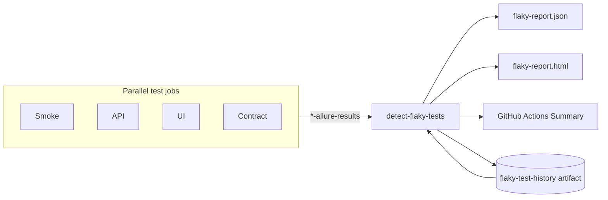

# Flaky Test Detection (CI)

Production-grade flaky test **classification** for nightly CI. Detects instability across runs without rerunning business tests and without treating CI infrastructure retries as flaky signals.

## Overview

| Capability | Description |
|------------|-------------|
| **Intermittent outcomes** | Pass and fail across historical nightly runs |
| **Duration instability** | High coefficient of variation (CV ≥ 0.35, ≥ 3 samples) |
| **Recovered this run** | Passed now after historical failures (classification only — no rerun) |
| **Failed-only** | Current-run failures **not** classified as flaky (separate bucket) |
| **History** | `flaky-test-history` artifact preserved between nightly runs (30 runs) |

## What is NOT flaky

- **CI infrastructure retries** (`retry.sh`, Docker pull, compose up, health-check loops) — these never produce Allure/Surefire entries
- **Security placeholder job** — no business tests
- **Automatic test reruns** — business tests are never rerun; only historical patterns are analyzed

## Pipeline integration



Job: **`detect-flaky-tests`** in `nightly-regression.yml`

- `needs`: test jobs + `regression-summary`
- `continue-on-error: true` — never fails the workflow
- Runs in parallel with Allure Pages publish (publish waits for flaky job)

## Outputs

| Artifact / output | Format | Retention |
|-------------------|--------|-----------|
| `{prefix}-flaky-report` | JSON + HTML | 30 days |
| `flaky-test-history` | JSON (cross-run store) | 90 days |
| GitHub Actions Summary | Markdown tables | Per run |

### JSON schema (excerpt)

```json
{
  "runId": "12345678",
  "workflow": "Nightly Regression",
  "flakyCount": 2,
  "failedOnlyCount": 1,
  "durationUnstableCount": 1,
  "recoveredThisRunCount": 1,
  "flakyTests": [
    {
      "testKey": "com.flowiq.ui.smoke.ExampleTest#shouldWork",
      "classification": "INTERMITTENT_OUTCOME",
      "failedInCurrentRun": false,
      "recoveredThisRun": true,
      "flakinessPercent": 50.0,
      "durationCv": 0.12
    }
  ],
  "failedTests": [
    {
      "testKey": "com.flowiq.api.ExampleTest#newFailure",
      "failedInCurrentRun": true,
      "classification": null
    }
  ]
}
```

## Classification rules

| Signal | Condition | `FlakyClassification` |
|--------|-----------|-------------------------|
| Intermittent | ≥ `minRuns` (2) with both pass and fail/broken | `INTERMITTENT_OUTCOME` |
| Duration unstable | CV ≥ 0.35 across ≥ 3 durations | `DURATION_UNSTABLE` |
| Both | Both conditions | `INTERMITTENT_AND_DURATION` |
| Failed-only | Failed in current run, no historical flakiness | Listed under `failedTests` only |

A test may **fail in the current run** and still appear under **`flakyTests`** if it is historically unstable — the GitHub Summary lists these in separate sections.

## History file

Path in CI: `flaky-history/flaky-test-history.json`

```json
{
  "version": 1,
  "maxRuns": 30,
  "runs": [
    {
      "runId": "123",
      "workflow": "Nightly Regression",
      "timestamp": "2026-06-28T03:15:00Z",
      "source": "business-tests",
      "executions": [
        {
          "testKey": "...",
          "outcome": "PASSED",
          "durationMs": 1500
        }
      ]
    }
  ]
}
```

Only `source: business-tests` entries are loaded — infrastructure is never stored.

## Local execution

```bash
# After a local CI stack test run
export ALLURE_RESULTS_DIR=merged-allure-results
export FLAKY_HISTORY_FILE=flaky-history/flaky-test-history.json
export FLAKY_OUTPUT_DIR=flaky-report
export GITHUB_RUN_ID=local
export GITHUB_WORKFLOW=local

mvn -q exec:java \
  -Dexec.mainClass=com.flowiq.ci.flaky.CiFlakyTestAnalyzer \
  -Dexec.cleanupDaemonThreads=false

open flaky-report/flaky-report.html
```

## Source code

| Component | Path |
|-----------|------|
| Analyzer | `com.flowiq.ci.flaky.CiFlakyTestAnalyzer` |
| History store | `com.flowiq.ci.flaky.history.FlakyHistoryStore` |
| Duration CV | `com.flowiq.ci.flaky.analyzer.DurationStabilityAnalyzer` |
| Business filter | `com.flowiq.ci.flaky.filter.BusinessTestExecutionFilter` |
| Composite action | `.github/actions/detect-flaky-tests/` |
| Unit tests | `com.flowiq.ci.flaky.CiFlakyTestAnalyzerTest` |

Reuses existing Allure loaders and stability metrics from `com.flowiq.agents.flaky` (AI investigator) without invoking LLM or rerunning tests.

## Relationship to Allure history

| System | Purpose |
|--------|---------|
| **Allure `history/`** | Trend charts in Allure HTML (GitHub Pages) |
| **`flaky-test-history.json`** | Cross-run execution store for flaky **classification** |

Both are preserved between nightly runs independently.

## Troubleshooting

| Symptom | Cause | Action |
|---------|-------|--------|
| No flaky tests on first nightly | Need ≥ 2 runs per test | Expected; history builds over time |
| Empty report | No Allure artifacts downloaded | Check test job failures; merge step logs |
| Flaky count seems high | Legitimate instability | Review `flaky-report.html` CV and pass/fail columns |
| Infrastructure in report | Should not happen | Verify `BusinessTestExecutionFilter`; file an issue |
